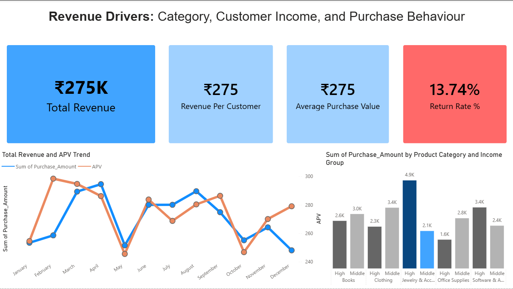
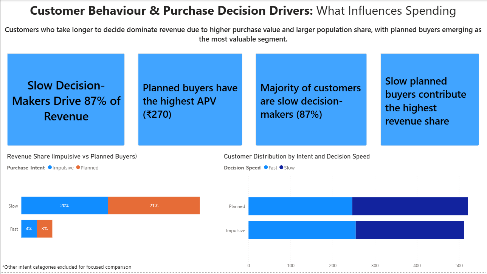

# 📊 Customer Behavior & Purchase Decision Analysis

## 🚀 Project Overview

This project analyzes customer behavior, purchasing patterns, and revenue drivers using SQL and Power BI to generate actionable business insights.

---

## 🎯 Business Objective

To identify:
- What drives customer purchases
- Who the most valuable customers are
- How businesses can optimize strategy to increase revenue

---

# 🧠 Key Questions Answered

### 💰 Revenue & Performance
- Where is the revenue coming from?
- Which segments generate the most revenue?
- What is the average purchase value (APV)?

### 🧠 Customer Behavior
- Do slow or fast decision-makers spend more?
- Do planned buyers outperform impulsive buyers?

### 👥 Customer Segmentation
- Who are the most valuable customers?
- Do loyalty program members spend more?

### 📢 Marketing & Influence
- Do discounts increase spending?
- Are ads effective in driving revenue?
- Does social media influence purchase behavior?

### ⭐ Customer Experience
- What causes product returns?
- Does customer satisfaction impact return rates?

---

# 📊 Dashboard Insights

---

## 📌 1. Revenue Drivers

💡 **Insight:** Revenue is primarily driven by high-income customers, with stable average purchase value across time.

---

## 📌 2. Customer Behavior

💡 **Insight:** Slow decision-makers and planned buyers contribute the highest revenue and purchase value.

---

## 📌 3. Customer Segmentation

💡 **Insight:** High-income adult customers are the most valuable segment, while non-loyal customers spend more per purchase.

---

## 📌 4. Marketing & Influence

💡 **Insight:** Advertising significantly impacts revenue, while discounts have minimal effect on spending behavior.

---

## 📌 5. Customer Experience

💡 **Insight:** Return behavior is not strongly driven by satisfaction, indicating product-level or operational issues.

---

## 📌 6. Business Recommendations

💡 **Insight:** Revenue growth can be achieved by targeting high-value segments, optimizing marketing spend, and reducing return rates.

---

# 🛠️ Tools & Technologies

- SQL  
- Power BI  
- DAX  

---

# 📈 Key Insights Summary

- High-income customers drive revenue  
- Planned and slow decision-makers are high-value  
- Loyalty programs are underperforming  
- Ads outperform discounts  
- Returns are driven by category issues, not satisfaction  

---

# 💡 Business Impact

- Improved customer targeting  
- Better marketing ROI  
- Reduced revenue loss from returns  
- Data-driven strategy development  

---

# 👤 Author

**Himanshu Gupta**  
Aspiring Data Analyst  

---

# ⭐ If you found this useful

Give it a ⭐ on GitHub!
